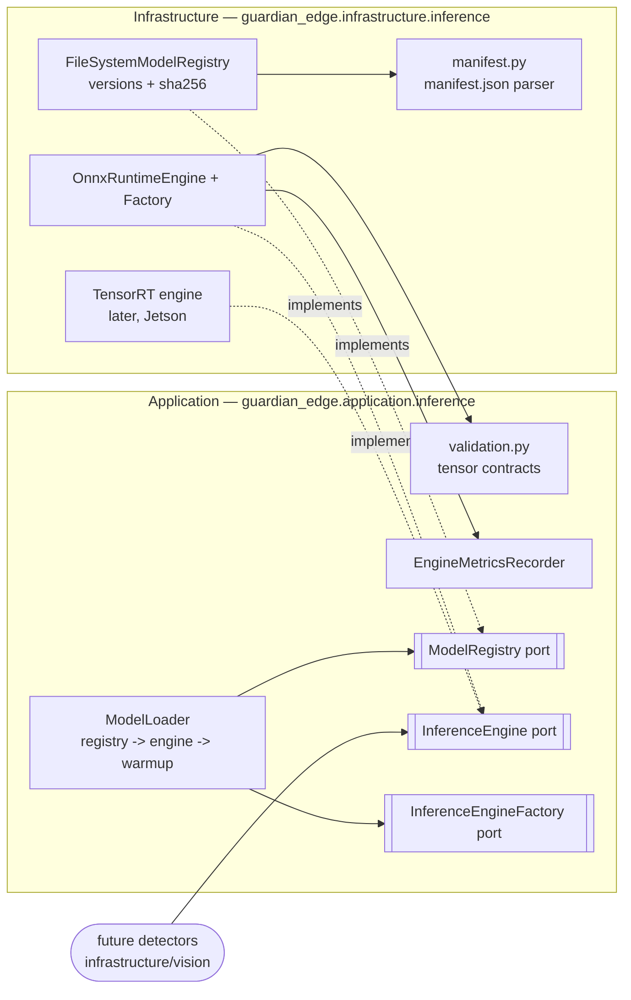

# Inference Runtime

- **Date:** 2026-07-05 (Sprint 4)
- **Reflects:** ADR-0001 §7 (ONNX canonical), ADR-0008 (runtime contracts)
- **Scope:** model-agnostic runtime only — no models, no detectors, no task logic

## Purpose

Everything between "a model artifact exists on disk" and "a verified, warm,
measured engine is serving": registry → loader → engine. The runtime never
interprets tensors; task meaning lives above the `Detector` seam (ADR-0006).

## Component view



## The load path (the only one)

```
ModelLoader.load("fall-detector")            # version optional -> latest
  └─ registry.get(...)        FileSystemModelRegistry
       ├─ resolve version     active pointer first (zoo state.json, ADR-0009),
       │                      newest semver when never activated
       ├─ parse manifest.json strict; unparseable = untrusted
       ├─ artifact exists?    ModelRegistryError if not
       └─ sha256 verify       declared checksum must match; warn if absent
  └─ factory.load(...)        OnnxRuntimeEngineFactory
       ├─ create session      providers configurable (CPU default)
       └─ verify real I/O     names/dtypes/ranks/fixed dims vs manifest
  └─ engine.warmup(n)         zero tensors; excluded from inference metrics
```

## Registry layout

```
models/
  fall-detector/
    1.0.0/
      manifest.json
      model.onnx
    1.1.0/
      ...
```

`manifest.json` (mirrors the future contracts/models schema; `ai/export`
emits one per artifact — no manifest, no load):

```json
{
  "name": "fall-detector",
  "version": "1.1.0",
  "task": "fall-detection",
  "file": "model.onnx",
  "sha256": "…",
  "inputs":  [{"name": "input",  "dtype": "float32", "shape": [1, 3, null, null]}],
  "outputs": [{"name": "output", "dtype": "float32", "shape": [1, 3, null, null]}]
}
```

`null` dimensions are dynamic (resolved per call); the first dimension is
the batch dimension and must be 1 (ADR-0008 §3).

## Validation: fail loudly, at the boundary

| Stage | Check | Failure |
|---|---|---|
| Registry | manifest parses, artifact exists, sha256 matches | `ModelRegistryError` |
| Factory | manifest agrees with the real graph (names, dtypes, ranks, fixed dims) | `ModelLoadError` |
| Every `infer()` | exact input-name set, tensor-likeness, dtype, rank, fixed dims, batch = 1, dynamic dims positive | `TensorValidationError` — the backend is never reached |

## Metrics & profiling

- Always on: per-engine `EngineMetrics` — inferences/errors/warmup totals,
  last/mean/p50/p95 latency over a sliding window (~10 s at 24 FPS). Same
  surface for every backend via `EngineMetricsRecorder`.
- Opt-in: ONNX Runtime operator-level profiling
  (`OnnxRuntimeEngineFactory(profiling_dir=…)`); the JSON trace path is
  logged when the engine closes. For latency-budget deep dives on target
  hardware.

## Testing approach

Unit tests author tiny synthetic Identity graphs with the `onnx` helper
(dev-only dependency) — the runtime is exercised end-to-end (dynamic
shapes across calls, manifest-vs-graph mismatches, checksum tampering,
profiling traces) with no AI model anywhere.

## Out of scope (later sprints)

Real detectors composing engines (blocked on ADR-0003 licensing), TensorRT
engine on Jetson (nightly bench job), signed OTA model delivery into the
registry layout, GPU execution providers.
