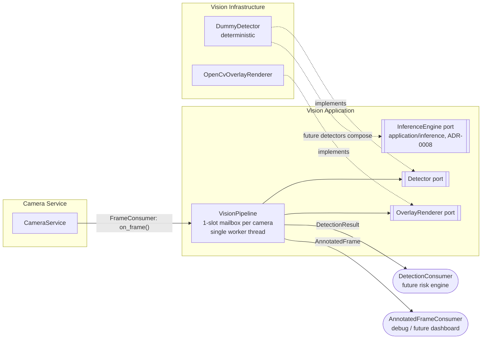

# Vision Pipeline

- **Date:** 2026-07-05 (Sprint 3)
- **Reflects:** ADR-0001 (Clean Architecture), ADR-0006 (vision pipeline decisions)
- **Scope:** vision infrastructure only — no real models, no tracking, no risk engine

## Purpose

Turns the camera service's frame stream into `DetectionResult`s and optional
annotated overlay frames. Today it runs the deterministic `DummyDetector`;
real detectors replace it behind the same port without touching the pipeline.

## Component view



The **only** coupling to the camera service is `pipeline.on_frame` passed as
its `FrameConsumer`; capture has no knowledge of AI. The **only** outbound
coupling is the consumer callables; vision has no knowledge of the risk
engine (ADR-0006 §4).

## Data flow and threading

```
capture thread (per camera)          vision worker (one thread)
────────────────────────────         ─────────────────────────────
frame ──> on_frame():                loop:
            mailbox[cam] = frame       frame = pop next pending camera
            (replaces unprocessed      result = detector.detect(frame)
             frame; drop counted)      detection_consumer(result)
            return immediately         overlay? render -> annotated_consumer
```

- **Latest-frame-wins:** a newer frame replaces an unprocessed older one;
  drops are counted in `PipelineStats`, never silent. Real-time monitoring
  analyzes the present, not a backlog.
- **Failure isolation:** a crashing detector skips that frame (counted as
  `detector_errors`); a crashing consumer loses that result only; the worker
  never dies. Overlay failures never cost detection results.
- `process_once()` allows deterministic, threadless processing in tests.

## Domain model

| Type | Meaning |
|---|---|
| `BoundingBox` | Normalized `[0,1]` geometry, top-left origin; `to_pixels()` maps to a frame (ADR-0006 §2) |
| `Detection` | label + confidence (validated `[0,1]`) + box, **plus full identity** (ADR-0007): `detection_id`, `frame_id`, `camera_id`, `captured_at`, `correlation_id` — self-contained for tracking, risk, analytics, notifications |
| `DetectionResult` | everything concluded about one frame: detections, `ModelDescriptor` (name + version — every result is traceable to a model, docs/04), inference latency; rejects detections whose identity disagrees with its own |
| `ModelDescriptor` | model identity carried on every result |

### Identity & correlation (ADR-0007)

`frame_id` and `correlation_id` are minted **at capture** in the `Frame`
constructor; `detection_id` is minted by the detector. Downstream stages
propagate ids, never regenerate them. `correlation_id` is the trace token
of the whole causal chain (capture → detections → tracks → risk events →
notifications → analytics), so any alert can be traced back to the exact
frame that caused it.

## Overlay renderer

`OpenCvOverlayRenderer` draws on a **copy** of the frame buffer (the original
is never mutated — other consumers see original pixels): per-label stable
colors (CRC-indexed palette), label + confidence caption per box (confidence
is always visible, docs/04), FPS top-left, frame timestamp (UTC) bottom-left.

## DummyDetector

Deterministic synthetic detections — a pure function of frame sequence, so
identical frames yield identical results across runs. Boxes sweep the frame
so the flow is visibly alive in development. It never ships to production;
it exists so pipeline, overlay, tests, and future consumers work before any
model does.

## Observability

`VisionPipeline.stats()` per camera: frames received / processed / dropped,
detector errors, processing FPS (10 s window). Complements the camera
service's `CameraHealth`.

## Out of scope (later sprints)

Model backends implementing `InferenceEngine` (ONNX Runtime, TensorRT),
real detectors, tracking, pose estimation, risk engine, evidence clips.
Their seams exist: `InferenceEngine`, `Detector`, `DetectionConsumer`.
